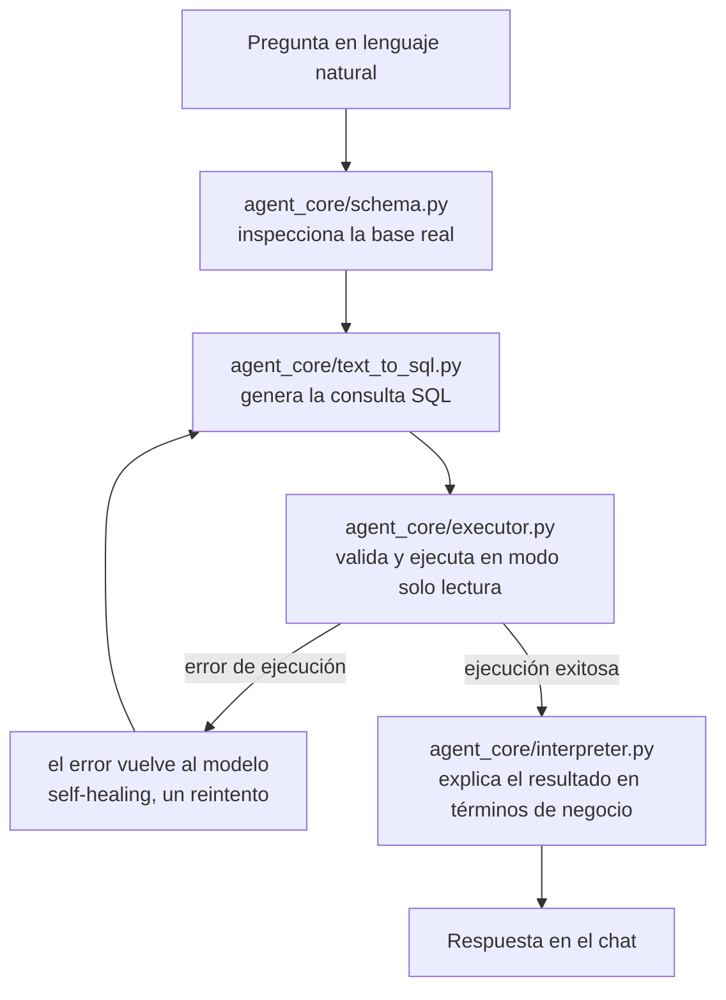

# Agente Analítico Text-to-SQL

Un agente que dialoga con bases de datos relacionales: convierte preguntas en
lenguaje natural en SQL, lo ejecuta con validaciones de seguridad y
autocorrección ante errores, y devuelve no solo los números sino una
interpretación de negocio. Funciona contra cualquier base (no solo la demo
sintética incluida), detectando el esquema y el dialecto SQL automáticamente.

**Stack:** Python · [Claude](https://www.anthropic.com) (Anthropic API) ·
SQLAlchemy · pandas · Streamlit

## Cómo funciona



Cada pregunta pasa por cinco capas independientes, cada una en su propio
módulo dentro de `agent_core/`: lectura del esquema, generación de SQL,
ejecución segura, autocorrección ante errores, e interpretación del
resultado. `app.py` es la única pieza que conoce las cinco a la vez.

## Instalación

```bash
git clone https://github.com/Cesar0098/text-to-sql-agent.git
cd text-to-sql-agent
python -m venv venv
source venv/bin/activate   # en Windows: venv\Scripts\activate
pip install -r requirements.txt
```

## Configuración

```bash
cp .env.example .env
```

Completá `ANTHROPIC_API_KEY` en el `.env` con tu API key de Anthropic.
`DATABASE_URL` es opcional: si la dejás vacía, el agente usa la base SQLite
de demo. Para conectarlo a tu propia base, mirá los ejemplos de connection
string en `.env.example` y la sección de seguridad más abajo — para
Postgres o MySQL hace falta un usuario de solo `SELECT`, no tus
credenciales de administrador.

## Generar la base de demo

```bash
python -m data_generation.generate_db
```

Crea `empresa_b2b.db`: una base SQLite sintética de una empresa B2B de
servicios digitales (clientes, servicios, pagos), regenerable en cualquier
momento con el mismo comando.

## Correr la app

```bash
streamlit run app.py
```

Se abre en `http://localhost:8501`. Chat a la izquierda, consola con el SQL
generado y ejecutado a la derecha. La barra lateral tiene preguntas de
ejemplo para no tener que escribir nada en una demo.

Para probar el flujo sin interfaz (útil para debuggear el agente en
aislamiento):

```bash
python probar_flujo.py
```

## Estructura del repo

```
.
├── agent_core/
│   ├── config.py            # DATABASE_URL, dialecto SQL, carga de .env
│   ├── schema.py             # inspección del esquema + detección de categóricas
│   ├── text_to_sql.py        # pregunta -> SQL
│   ├── executor.py           # valida y ejecuta el SQL en modo solo lectura
│   ├── agent.py               # orquesta generación + ejecución + self-healing
│   └── interpreter.py         # resultado crudo -> explicación de negocio
├── data_generation/
│   ├── generate_db.py         # genera la base SQLite de demo
│   └── glosario_demo.py       # glosario opcional de contexto de negocio
├── prompts/
│   ├── generar_sql.txt
│   └── interpretar_resultado.txt
├── app.py                     # interfaz en Streamlit
├── probar_flujo.py            # prueba de punta a punta sin UI
├── requirements.txt
└── .env.example
```

## Seguridad: cómo se previene SQL injection y escritura accidental

El agente nunca ejecuta SQL "a ciegas". Hay tres capas independientes,
pensadas para que si una falla, las otras dos sigan protegiendo la base:

### 1. Validación del texto de la consulta (`agent_core/executor.py`)

Antes de tocar la base, cada consulta generada por el modelo pasa por
`validar_consulta()`, que rechaza cualquier cosa que no sea un único
`SELECT`:

- Tiene que empezar con `SELECT`.
- No puede tener más de una sentencia (se busca un `;` antes del final,
  que sería la forma típica de un ataque de SQL injection encadenado).
- No puede contener palabras como `insert`, `update`, `delete`, `drop`,
  `alter`, `create`, `truncate`, `attach` o `pragma`, sin importar dónde
  aparezcan en la consulta.

Esta capa es independiente del motor de base de datos: funciona igual
para SQLite, Postgres o MySQL.

### 2. Conexión real de solo lectura (depende del motor)

- **SQLite** (el modo demo, por defecto): la conexión se abre con
  `sqlite3.connect("file:archivo.db?mode=ro", uri=True)`. Esto hace que
  la base rechace cualquier escritura a nivel de driver, incluso si la
  validación del punto 1 fallara. Se puede comprobar corriendo un
  `DELETE` directo contra esa conexión: SQLite lo rechaza con
  `attempt to write a readonly database`.
- **Postgres / MySQL / otros motores**: no existe un equivalente al
  `mode=ro` de SQLite a nivel de connection string. Para tener una
  protección real acá, **hace falta crear un usuario de base de datos
  con permisos de solo `SELECT`** y usar sus credenciales en
  `DATABASE_URL`. Por ejemplo, en Postgres:

  ```sql
  CREATE USER agente_readonly WITH PASSWORD 'una_contraseña_segura';
  GRANT CONNECT ON DATABASE tu_base TO agente_readonly;
  GRANT USAGE ON SCHEMA public TO agente_readonly;
  GRANT SELECT ON ALL TABLES IN SCHEMA public TO agente_readonly;
  -- para que las tablas que se creen después también queden de solo lectura:
  ALTER DEFAULT PRIVILEGES IN SCHEMA public GRANT SELECT ON TABLES TO agente_readonly;
  ```

  En MySQL el equivalente es `GRANT SELECT ON tu_base.* TO 'agente_readonly'@'%';`.

  Esto es responsabilidad de quien despliega el agente, no algo que el
  código pueda garantizar por sí solo — por eso queda documentado acá
  en vez de asumido en silencio.

### 3. Límite de filas por consulta (`agent_core/executor.py`)

Si la consulta generada no trae su propio `LIMIT`, el ejecutor le agrega
uno (200 filas por defecto) antes de correrla. No es una medida de
seguridad contra ataques, sino contra un problema real de otro tipo:
una pregunta como "mostrame todos los pagos" puede generar un `SELECT *`
sin `LIMIT` que devuelva miles de filas, infle el prompt de la capa de
interpretación de negocio y encarezca la llamada al modelo sin agregar
valor. El prompt (`prompts/generar_sql.txt`) también le pide al modelo
que agregue un `LIMIT` razonable por su cuenta, pero esta capa en código
no depende de que el modelo obedezca esa instrucción.

## Por qué el esquema no está hardcodeado

`agent_core/schema.py` inspecciona la base real con SQLAlchemy en vez
de asumir una estructura fija de tablas. Esto es lo que permite que el
mismo agente funcione contra cualquier base de datos: basta con cambiar
`DATABASE_URL`. Las columnas categóricas (con pocos valores distintos
en relación al total de filas) se detectan automáticamente para
mostrarle al modelo los valores reales que existen, en vez de dejar que
los adivine.

## Limitaciones conocidas

- **Umbral de columnas categóricas calibrado a mano.** `MAX_PROPORCION_DISTINTOS`
  en `schema.py` (10% por defecto) funciona bien para la base de demo
  (~150 filas), pero en una base con millones de filas probablemente haya
  que ajustarlo o pasar a un enfoque distinto (por ejemplo, un tope
  absoluto en vez de proporcional).
- **El `LIMIT` automático no revisa subconsultas anidadas.** Si una
  subquery interna ya trae su propio `LIMIT` pero la consulta externa no,
  el chequeo actual (busca la palabra `limit` en cualquier parte del
  texto) no agrega uno a la externa. Poco probable con las preguntas que
  genera el modelo hoy, pero es una simplificación consciente.
- **La compatibilidad con Postgres/MySQL está probada solo a nivel de
  dialecto y permisos**, no contra una base real de esos motores — el
  desarrollo y las pruebas se hicieron enteramente contra la base SQLite
  de demo.
- **Sin tests automatizados (`pytest`) todavía.** Las validaciones se
  hicieron manualmente durante el desarrollo (esquema, ejecución segura,
  self-healing, interpretación); formalizarlas como suite de tests sería
  el siguiente paso natural.
